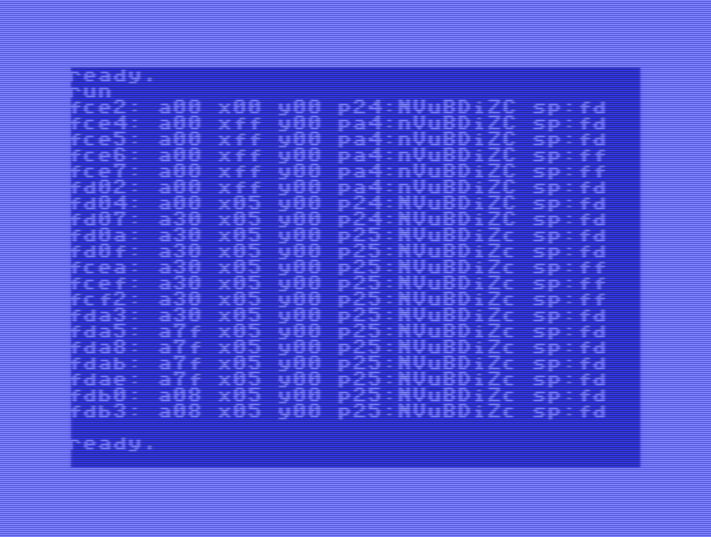

# simulators

A collection of some cpu simulators.

The whole repo is self-contained, no external libs are used.
I tried to make it highly portable, C/C++ (using gcc/g++, but on windows...).
Not tested on anything else so far.
Only gcc/g++/make needed.

##

Please remind:

This repo is my own fun stuff to learn things better.
I decided to polish a bit and to relase it to share my 'joy' (my wife doesn't understand this ?!?).
Its still WIP, but i hope things online arent broken (too much or too often).

There are many things not working, i know.
E.g., the most sims here are cycle-exact-op-driven, but not cycle-driven.
I learned that on my c64-sim (which is not shared yet, because of exactly these issues).
So learning goal succeeded, but not important enough (for me) to drive this now.

There are many things you would make different, i know.
Please share your insights i like to learn (as mentioned above 'some' times).

I'm not a native english speaker, but i'm also to lazy to prove-read or translate this, this repo is fun, not work.
Feel free to help me out...
Dankeschön.

Some numbers in this repo might be old, i dont run every test here again and again after code changes.
Its too hot (~40°C now) to run the CPU and GPU at full speed below my desk...

##

If you are on **windows**:
Install cygwin gcc/g++/make.
Install oscar64 optionally (for just two examples here).
Install msvc and cuda optionally (for just some experiments here).
The main `_make.bat` compiles all binaries in all dirs.
The main `_clean.bat` cleans up the mess.

##

**mac** or **linux** is hopefully not too much work since gcc is used mostly.
Feel free to 'port', have fun with "\\" and "/".

##

Pay me in github stars ;-)

---


## (yet another) 6502 simulator

I'm working on this many decades now ;-)
Time to release before i die...

**Portable:**
	in C89 to be as portable as possible.

**Selfcontained:**
	no dependencies.
	no installations or configurations needed.
	and no annoying licenses.

- Full NMOS and CMOS support (5 variants)
- All bugs preserved (e.g. jmpbug)
- Cycle exact (if needed)

Optimized for various usages with many defines ("not too good" documented yet).

| Define | Effect |
|-------|--------|
| `DEBUG` | enable cpu6502_dump() and illegal opcode warnings |
| `SINGLE_INST` | bare static globals, no cpu pointer param |
| `MEM_IO` | memory r/w callbacks for I/O-mapped hardware |
| `COUNT_CYCLES` | step() returns cycle count, else void |
| `ILLEGAL` | implement NMOS illegal opcodes: KIL/JAM halts CPU |
| `NO_NZ_TABLE` | branch-based SETNZ instead of 256B lookup |
| `NO_IO_MAP` | all MEM_IO via callback, no io_map bitmap (saves 256B) |

CPU variants, default `MOS6502`:

| Variant | Description |
|---------|-------------|
| `MOS6502` | NMOS (JMP ind page-wrap bug, BCD flags mid-result, the "original") |
| `RICOH2A03` | NMOS, no BCD (decimal flag ignored, NES) |
| `ROCKWELL65C02` | CMOS (fixed JMP ind, BCD flags from final result) |
| `SYNERTEK65C02` | CMOS (RMW illegals → NOPs) |
| `WDC65C02` | CMOS + BBR/BBS/RMB/SMB, STP/WAI |

Thanks to all brothers and sisters in mind:
All 6502 simulator developers sharing their work, I found 20 projects without searching too much !
I couldn't test all of them because of missing dependencies or needed installations or configurations which failed.

### source files

#### the simulator itself

- `6502/cpu6502.h`
- `6502/cpu6502.c`
- `sim.h`

```
	#include "cpu6502.h"
	#include <stdio.h>
	#include <stdlib.h>
	#include <string.h>

	static void load(u8 *ram, const char* path, u16 addr) {
		FILE* f = fopen(path, "rb");
		if (!f) { fprintf(stderr, "Can't open %s\n", path); exit(1); }
		fseek(f, 0, SEEK_END); long n = ftell(f); fseek(f, 0, SEEK_SET);
		fread(&ram[addr], 1, (size_t)n, f);
		fclose(f);
	}

	int main() {
		static u8 ram[65536] = {};
		load(ram, "basic_a000.rom",  0xA000);
		load(ram, "kernal_e000.rom", 0xE000);
		CPU6502 cpu;
		cpu6502_init(&cpu, ram, NULL, NULL);
		cpu6502_reset(&cpu);
		if (cpu.PC != 0xFCE2) { printf("FAIL: wrong reset vector\n"); return 1; }
		int cycles = 0, i = 0;
		for (; i < 20; i++) {
			cpu6502_dump(&cpu);
			cycles += cpu6502_step(&cpu);
		}
		printf("%d steps (%d cycles): PC=$%04X A=$%02X X=$%02X Y=$%02X SP=$%02X\n", i, cycles, cpu.PC, cpu.A, cpu.X, cpu.Y, cpu.SP);
		return 0;
	}
```
gives
```
	PC=FCE2 A=00 X=00 Y=00 P=24:nvUbdIzc SP=FD
	PC=FCE4 A=00 X=FF Y=00 P=A4:NvUbdIzc SP=FD
	PC=FCE5 A=00 X=FF Y=00 P=A4:NvUbdIzc SP=FD
	PC=FCE6 A=00 X=FF Y=00 P=A4:NvUbdIzc SP=FF
	PC=FCE7 A=00 X=FF Y=00 P=A4:NvUbdIzc SP=FF
	PC=FD02 A=00 X=FF Y=00 P=A4:NvUbdIzc SP=FD
	PC=FD04 A=00 X=05 Y=00 P=24:nvUbdIzc SP=FD
	PC=FD07 A=30 X=05 Y=00 P=24:nvUbdIzc SP=FD
	PC=FD0A A=30 X=05 Y=00 P=25:nvUbdIzC SP=FD
	PC=FD0F A=30 X=05 Y=00 P=25:nvUbdIzC SP=FD
	PC=FCEA A=30 X=05 Y=00 P=25:nvUbdIzC SP=FF
	PC=FCEF A=30 X=05 Y=00 P=25:nvUbdIzC SP=FF
	PC=FCF2 A=30 X=05 Y=00 P=25:nvUbdIzC SP=FF
	PC=FDA3 A=30 X=05 Y=00 P=25:nvUbdIzC SP=FD
	PC=FDA5 A=7F X=05 Y=00 P=25:nvUbdIzC SP=FD
	PC=FDA8 A=7F X=05 Y=00 P=25:nvUbdIzC SP=FD
	PC=FDAB A=7F X=05 Y=00 P=25:nvUbdIzC SP=FD
	PC=FDAE A=7F X=05 Y=00 P=25:nvUbdIzC SP=FD
	PC=FDB0 A=08 X=05 Y=00 P=25:nvUbdIzC SP=FD
	PC=FDB3 A=08 X=05 Y=00 P=25:nvUbdIzC SP=FD
	20 steps (70 cycles): PC=$FDB6 A=$08 X=$05 Y=$00 SP=$FD
```

### testing

#### some little tests

- `main.h` — some very little test helpers

- `main000.cpp` — 6502-on-6502
  probably the smallest 6502 simulator currently simulating itself: main000.prg is **5591 bytes** (without printf) !
  and maybe the only time in computing history a NULLPTR is a valid ptr: `#define ram ((u8*)0)` !

- `main001.cpp` — added some "useful" output to main000.cpp, even with printf still very small
  starts booting (on) a c64 ;-)
  

- `main002.cpp` — a bit more functional, not a single global instance anymore

- `main003.cpp` — added basic irqs, let the c64 "boot" to READY.
```
	2706955 cycles, 159 IRQs: PC=$E5CD A=$00
	Jiffy: $04 $00 $00

		**** COMMODORE 64 BASIC V2 ****

	 64K RAM SYSTEM  51216 BASIC BYTES FREE

	READY.
```

51216 bytes free becuse no no proper ram management.

#### the big tests

Thanks to all cpu testers sharing results.
Tom Harte (https://github.com/SingleStepTests/65x02) did a great job: 10000 tests for each opcode helped a lot !
Klaus Dormann (https://github.com/Klaus2m5/6502_65C02_functional_tests) helped also a lot to get things right !

---


## (yet another) 6502 simulator (V2)

"M" for Mini.

This time in small, maybe the smallest (**4916 bytes ;-)
In C++, and not really nice readable...
Not optimized for speed, only for size.
Not even cycle counting (use the "real" cpu6502.c/h for that).
But small, less than 100 "lines", less than 5kB.
More the category "why ?"...

- Only NMOS 6502
- No illegal opcodes

### source files

#### the simulator itself

- `6502M/cpu6502M.h`

### testing

#### a little test

- `main001.cpp`
	minimal example for the minimal simulator
	a "booting" c64 in <6k source code
```
	PC=FCE2 A=00 X=00 Y=00 P=24 SP=FD
	PC=FCE4 A=00 X=FF Y=00 P=A4 SP=FD
	PC=FCE5 A=00 X=FF Y=00 P=A4 SP=FD
	PC=FCE6 A=00 X=FF Y=00 P=A4 SP=FF
	PC=FCE7 A=00 X=FF Y=00 P=A4 SP=FF
	PC=FD02 A=00 X=FF Y=00 P=A4 SP=FD
	PC=FD04 A=00 X=05 Y=00 P=24 SP=FD
	PC=FD07 A=30 X=05 Y=00 P=24 SP=FD
	PC=FD0A A=30 X=05 Y=00 P=25 SP=FD
	PC=FD0F A=30 X=05 Y=00 P=25 SP=FD
	PC=FCEA A=30 X=05 Y=00 P=25 SP=FF
	PC=FCEF A=30 X=05 Y=00 P=25 SP=FF
	PC=FCF2 A=30 X=05 Y=00 P=25 SP=FF
	PC=FDA3 A=30 X=05 Y=00 P=25 SP=FD
	PC=FDA5 A=7F X=05 Y=00 P=25 SP=FD
	PC=FDA8 A=7F X=05 Y=00 P=25 SP=FD
	PC=FDAB A=7F X=05 Y=00 P=25 SP=FD
	PC=FDAE A=7F X=05 Y=00 P=25 SP=FD
	PC=FDB0 A=08 X=05 Y=00 P=25 SP=FD
	PC=FDB3 A=08 X=05 Y=00 P=25 SP=FD
```

---


## (yet another) 6502 simulator (V3)

"T" for Transistor.

"Engine T" — transistor-level simulation.
Simulates the real 6502 "silicon" at the transistor/netlist level using the visual6502 netlist data (many thanks to James / Silverman / Silverman).
(Kind of) drop-in replacement for cpu6502.h.
Same struct, same function signatures (but more).
Not optimized for speed, only for accuracy.
6502M is the smallest simulator, 6502T is the slowest (well, cuda is !).

- Only NMOS 6502
- Illegal opcodes handled naturally by the netlist

Since this is 100% silicon compatible, with all bugs and quirks, it's a perfect test generator !
See main004.cpp to generate Tom Harte compatible "perfect zips" (named after perfect6502). As much as you need !
See main005.cpp for testing Tom Harte zips or the perfect zips.
Sorry for the mainT012345abctxyz scheme, thats obviously how my brains netlist works.
One "bug" i found in my cpu6502.c/h this way: I flag is set after reset on real cpus.

### source files

#### the simulator itself

-DENGINE_T
to replace cpu with T-model

- `6502T/cpu6502T.h`
- `6502T/cpu6502T.c`
- `6502T/netlist_6502.h` - the "real" 3510 transistors
- `sim.h`

-DENGINE_CUDA
to replace cpu with gpu

- `6502T/cpu6502CUDA.h`
- `6502T/cpu6502CUDA.cu`
- `6502T/netlist_6502.h`

### testing

---

- `main001.cpp`
	just some cpu steps, but in 3 variants
		main001.exe uses cpu6502.c/h
		main001t.exe uses cpu6502T.c/h
		main001c.exe uses the cuda variant (nvidia only)

---

- `main002.cpp`

|     Engine     |     MIPS     |      Speed vs C      |
|----------------|--------------|----------------------|
| cpu6502.c      | ~450 MIPS    | baseline             |
| cpu6502T.c     | ~0.006 MIPS  | ~75,000× slower      |
| cpu6502CUDA.cu | ~0.0003 MIPS | ~1.3 million× slower |

- `main002.exe`
	using `6502/cpu6502.c/h`
	"boot" the C64 to READY.
	a little benchmark ...
	the good.
```
took 1.797ms
  422.54646633 MIPS
  1506.37451308 MCPS
2706955 cycles, 159 IRQs
PC=E5CD A=00 X=00 Y=0A P=22:nvUbdiZc SP=F3
Jiffy: $04 $00 $00

    **** COMMODORE 64 BASIC V2 ****

 64K RAM SYSTEM  51216 BASIC BYTES FREE

READY.
```

51216 bytes free becuse no no proper ram management.

- `main002t.exe`
	using `6502T/cpu6502T.c/h`
	... vs cpu6502T.c/h 
	the bad.
	the transistor sim in C is slow because it has to be - it's evaluating 3,510 transistors per cycle to faithfully model the silicon.
```
[6502T] Running 1000000 cycles...
  [##############################] 100%  1000005/1000000    0.02 MIPS  ETA   0s
took 50973.063ms
  0.00549035 MIPS
  0.01961830 MCPS
1000005 cycles, 58 IRQs
PC=FD75 A=55 X=00 Y=AF P=25:nvUbdIzC SP=FD
Jiffy: $00 $00 $00
```
not enough cycles given to show "boot screen".
would take some minutes at 0.005 MIPS !

- `main002c.exe`
	using `6502T/cpu6502CUDA.cu/h`
	... vs cuda
	surprise ! 0.0003 MIPS on a RTX4090 !
	the ugly.
	the netlist is a deeply sequential state machine. there's no good exploitable parallelism.
	and 3510 transistors is "nothing" for a gpu.
```
[6502C] Running 100000 cycles...
  [##############################] 100%   100000/100000    0.00 MIPS  ETA   0s
took 90166.900ms
  0.00030889 MIPS
  0.00110905 MCPS
100000 cycles, 5 IRQs
PC=FD84 A=00 X=00 Y=64 P=27 SP=FD
Jiffy: $00 $00 $00
```
not enough cycles given to show "boot screen".
would take some more minutes at 0.0003 MIPS !

---

- `main003`
some simple benchmarks

**6502**: cpu6502.c/h
```
Workload                    Insns            MIPS   Time(ms)
Counter DEX+BNE          10000000     377.5251715    26.4883
Fibonacci(20)            10000000     375.7096215    26.6163
Idle JMP-self            10000000     374.6468953    26.6918
MemFill 256B             10000000     376.3884027    26.5683
Copy LDAiy+STAiy         10000000     378.5082988    26.4195
Multiply 8bit            10000000     377.0696410    26.5203
```

**6502T**: cpu6502T.c/h
```
Workload                    Insns            MIPS   Time(ms)
Counter DEX+BNE             10000       0.0032171  3108.4122
Fibonacci(20)               10000       0.0032770  3051.5462
Idle JMP-self               10000       0.0032538  3073.2985
MemFill 256B                10000       0.0032819  3047.0408
Copy LDAiy+STAiy            10000       0.0032634  3064.2685
Multiply 8bit               10000       0.0032846  3044.5005
```

**6502C**: cpu6502CUDA.cu/h
```
Workload                    Insns            MIPS   Time(ms)
Counter DEX+BNE              1000       0.0001883  5312.0360
Fibonacci(20)                1000       0.0001951  5126.3454
Idle JMP-self                1000       0.0001957  5109.4650
MemFill 256B                 1000       0.0001953  5119.6000
Copy LDAiy+STAiy             1000       0.0001957  5108.5652
Multiply 8bit                1000       0.0001935  5169.1468
```

---

- `main004`
generate Tom Harte compatible "perfect zips" (named after perfect6502).
maybe the only useful thing in this directory...
since i only have one transistor list, only this cpu type is generated.
toms zip supports 5 variants, so its much bigger.
it takes a while to create a 10k zip, so i prepared it: `6502T/65x02-perfect.zip`.
if you need reproducable zips, use "--seed <u64>".

---

- `main005`
testing "cpu6502.c/h" on Tom Harte zips or the perfect zips.

---


## (yet another) 6502 simulator — eXtreme edition (V4)

"X" for eXtreme (or eXperiment).

WIP and prototype area here !
But better releasing already workable stuff than waiting for 99% beautyful source code (which will never come).
One of the first comments was "warum bloß !" ('but why ??').
Well, i'm curious, its getting more and more theroetical now.
Getting a bit absurd here, stop reading if it hurts !
The maybe only useful thing in this repo is `6502T/main004.cpp`.
This was (and is) an interesting journey so far.

**Some records:**
- The smallest 6502 sim source code is here: `6502M/cpu6502M.h` (**4916 bytes**)
- The smallest 6502 sim binary is here: `6502/main000.prg` (**5591 bytes**)
- The slowest 6502 sim is here: `6502T/main003c.exe` (**0.00018 MIPS**, thats 180 IPS, no M, no K, raw Instructions Per Second)
- The fastest 6502 sim is here: `6502X/main001ultra.exe` (**1.4 TIPS**, the one after GIPS which is the one after MIPS, thats 1400000000000 IPS)

### '100K' engine

100,000 independent 6502 instances on GPU, each with its own 64KB RAM.
100K was chosen because: <8GB VRAM (runs "everywhere") with full RAM per core minus safety margin.
~90% of VRAM usable for instances, rest reserved for CUDA context, display, kernels.

| Max instances | RAM usage |
|---------------|-----------|
| 58,974 | 3.6 GB |
| 117,949 | 7.2 GB |
| 176,924 | 10.8 GB |
| 235,899 | 14.4 GB |
| 353,850 | 21.6 GB |
| 471,800 | 28.8 GB |

#### V'max': ~830 GIPS

**Can we get more GIPS ?**
Reduce 64k RAM to 2k only, but more cpus.
Enough for a (synthetic) speed-test at least.

**Result:**
The 2k RAM now fits the 4090's L2 cache, so the per-step global-VRAM traffic drops and we escape the ~500 GIPS VRAM-bandwidth rate — ~830 GIPS.
That ~500 GIPS is still the RTX 4090's VRAM bandwidth: ~1008 GB/s VRAM, each 6502 step touches ~2 global bytes on average (opcode + operand), 1008/2 ≈ 504.

#### V'ultra': 1.39040 TIPS / 19.75 MIPS

**I want to have more GIPS !**
Shrink RAM to 4b ('bytes', yes, just enough for "JMP $0000" 4C 00 00).
And yes, we could go to 3... Or just 1 with NOP or BRK. Maybe next time.
But use 2.083B 6502-cores (**2 billion** ;-).

**Result:**
Another debunked optimization hypothesis.
~40 TIPS raw int32 4090 speed. -> GPU roofline (128 cores/SM × 128 SM × 2.52 GHz), reachable only by 1-instr counting work, not by faithful simulation.
~5-20 TIPS in "guessed" 6502 sim worload. -> 
1.4 TIPS is ceiling here for now.

I'd love to see results for a B200 !
Or test one myself, so please send me your spare cards (anything >=H100).

> what could we reach on a B200 cluster ?
< ~1,000 B200s (multi-rack): **~1.5 PIPS**

If you want to know: IPS, KIPS, MIPS, GIPS, TIPS, PIPS, EIPS, ZIPS, YIPS, RIPS, QIPS, ...
And the other direction: IPS, mIPS, µIPS, nIPS, pIPS, fIPS, aIPS, zIPS, yIPS, rIPS, qIPS, ...

#### whats after ultra ?

Yes, V5 exists also already now, but too much WIP...

For 6502: back from ultra-broad to brutal single code speed.
I'm working on a "block-jit" simulator, drop-in replacement for `6502/cpu6502.c/h`.
Already 3-4x speed of my `cpu6502.c/h`, ~1.5-2 GIPS on average load instead of 500 MIPS.
Up to 50 TIPS on some "well treated" sw-parts already, mainly detected and unrolled loops and things like that, NOP is of course a nop ;-)
cpu6502X.h, sim6581X.h, sim6567X.h, sim6526X.h are on my testbench now (if i find more time and motivation).
(Ja, noch so eine "warum bloß !" Aktion...)

And I've some more CPUs...

### source files

#### CUDA 100K mass-parallel

- `main.h` — little helpers

- `6502X/cpu6502CUDA100k.h` / `cpu6502CUDA100k.cu` — 'many' parallel 6502s on GPU (instruction-level, not transistor)

### build defines

| Define | Effect |
|--------|--------|
| `ENGINE_T` | use transistor-level engine (cpu6502T, in 6502T/) |
| `ENGINE_CUDA` | use CUDA netlist engine (cpu6502CUDA, in 6502T/) |
| `NUMCPUS` | number of parallel 6502 instances (default 100000) |

### testing

- `main001.cpp` — multi-engine benchmark: 6 micro-benchmarks across all engines
	- `main001.exe` — instruction-level (cpu6502.c)
```
=== 6502 ===
Workload                    Insns             MIPS   Time(ms) Result
--------------------------------------------------------------------
Counter DEX+BNE          10000000       375.303527    26.6451 PASS PC=$0305
Fibonacci(20)            10000000       380.485652    26.2822 PASS PC=$021B
Idle JMP-self            10000000       389.532483    25.6718 PASS PC=$0400
MemFill 256B             10000000       391.417008    25.5482 PASS PC=$050A
Copy LDAiy+STAiy         10000000       381.908243    26.1843 PASS PC=$0609
Multiply 8bit            10000000       387.832906    25.7843 PASS PC=$071E
```
	- `main001t.exe` — transistor-level (cpu6502T.c)
```
=== 6502T ===
Workload                    Insns             MIPS   Time(ms) Result
--------------------------------------------------------------------
Counter DEX+BNE             10000         0.009020  1108.6877 PASS PC=$0305
Fibonacci(20)               10000         0.003357  2978.6864 PASS PC=$0000
Idle JMP-self               10000         0.009210  1085.7823 PASS PC=$0400
MemFill 256B                10000         0.008299  1205.0302 PASS PC=$050A
Copy LDAiy+STAiy            10000         0.008128  1230.3077 PASS PC=$0609
Multiply 8bit               10000         0.008632  1158.5212 PASS PC=$071E
```
	- `main001c.exe` — transistor-level CUDA (cpu6502CUDA.cu)
```
=== 6502C ===
Workload                    Insns             MIPS   Time(ms) Result
--------------------------------------------------------------------
Counter DEX+BNE              1000         0.000190  5256.0680 PASS PC=$0000
Fibonacci(20)                1000         0.000195  5131.0901 PASS PC=$0000
Idle JMP-self                1000         0.000194  5158.2749 PASS PC=$0000
MemFill 256B                 1000         0.000195  5118.1409 PASS PC=$0000
Copy LDAiy+STAiy             1000         0.000195  5115.6811 PASS PC=$0000
Multiply 8bit                1000         0.000195  5137.0693 PASS PC=$0000
```
	- `main001max.exe` — 11M normal cores
```
=== CUDA 100K 6502 Benchmark ===
Instances: 11000000  RAM: 2KB  Warmup: 100  Measure: 10000

CPU100k V2: 11000000 instances × 2KB, 83.9 MB regs + 21484.4 MB RAM = 21568.3 MB total (interleaved+ZPcache)
Workload              Insns/GPU       GIPS  MIPS/inst   Time(ms)
--------------------------------------------------------------------------
Counter DEX+BNE      110000000000   878.3459     0.0798   125.2354
Fibonacci(20)        110000000000   888.7402     0.0808   123.7707
Idle JMP-self        110000000000   897.9724     0.0816   122.4982
MemFill 256B         110000000000   832.8740     0.0757   132.0728
Copy LDAiy+STAiy     110000000000   760.7124     0.0692   144.6013
Multiply 8bit        110000000000   881.9042     0.0802   124.7301
```
	- `main001ultra.exe` — 2B micro cores
```
=== CUDA ULTRA 6502 Benchmark (full RAM on-chip shared) ===
Instances: 2083000000  RAM: 4B  Warmup: 100  Measure: 10000

CPU100k V2: 2083000000 instances × 0KB, 15892.0 MB regs + 7946.0 MB RAM = 23838.0 MB total (interleaved+ZPcache)
Workload              Insns/GPU       GIPS  MIPS/inst   Time(ms)
--------------------------------------------------------------------------
Idle JMP-self        20830000000000  1405.6369     0.0007 14818.9056
```

---


## (yet another) 65816 simulator

In C89 to be as portable as possible.
No dependencies, no installations or configurations needed and no annoying licenses.
Passes Tom Harte test zip for 65816 cycle exact.

| Define | Effect |
|-------|--------|
| `DEBUG` | enable cpu65816_dump() and unhandled opcode warnings |
| `SINGLE_INST` | bare static globals, no cpu pointer param |
| `MEM_IO` | memory r/w callbacks for I/O-mapped hardware |
| `COUNT_CYCLES` | step() returns cycle count, else void; enables cpu65816_run() |
| `NO_IO_MAP` | all MEM_IO via callback, no io_map bitmap (saves 64KB!) |
| `RICOH5A22` | SNES Ricoh 5A22 (WIP, will never happen, i have no real 65816 here) |

Key differences from the 6502:

| Feature | 6502 | 65816 |
|---------|------|-------|
| Address space | 64 KB | 16 MB (24-bit) |
| Registers | A, X, Y (8-bit) | A(16), X, Y(8/16), D, PBR, DBR |
| Stack pointer | 8-bit ($0100-$01FF) | 16-bit (native), 8-bit (emulation) |
| Mode | — | Emulation (E=1) ↔ Native (E=0) |
| M/X flags | — | Select 8/16-bit accumulator and index width |
| Vectors | 3 (NMI/RST/IRQ) | 9 addresses across 2 modes (emu: COP/BRK+IRQ/NMI/RST, native: COP/BRK/ABT/NMI/IRQ) |
| Block moves | — | MVN/MVP (up to 64KB per instruction) |
| Direct page | Zero page ($0000) | Relocatable via D register |
| BCD | 8-bit only | 8-bit and 16-bit |

### source files

#### the simulator itself

- `65816/cpu65816.h`
- `65816/cpu65816.c`
- `sim.h`

### testing

- `main001.cpp`
	just small things: NOP, ADD, LINK, Fibonacci

#### the big tests

Tom Harte (https://github.com/SingleStepTests/65816) did a great job again: a lot of tests for each opcode helped a lot !


## (yet another) 68000 simulator

In C89 to be as portable as possible.
No dependencies, no installations or configurations needed and no annoying licenses.
Passes Tom Harte test zip for 68000 cycle exact.

### source files

#### the simulator itself

- `m68k/cpu68000.h`
- `m68k/cpu68000.c`
- `sim.h`

### testing

- `main001.cpp`
	just small things: NOP, ADD, LINK, Fibonacci

#### the big tests

Tom Harte (https://github.com/SingleStepTests/680x0) did a great job again: a lot of tests for each opcode helped a lot !


## (yet another) Z80 simulator

**Same approach:**
	in C89 to be as portable as possible
	no dependencies, no installations, no annoying licenses

- Undocumented opcodes, MEMPTR/WZ, and Q flag

| Define | Effect |
|-------|--------|
| `SINGLE_INST` | bare static globals, no cpu pointer param (max speed) |
| `MEM_IO` | memory r/w callbacks for I/O-mapped hardware |
| `COUNT_CYCLES` | step() returns cycle count (uint8_t), else void |
| `NO_IO_MAP` | all MEM_IO via callback, skip io_map bitmap check |
| `NO_SZP_TABLE` | compute SZP flags at runtime, no 256B lookup |
| `DEBUG` | enable cpuZ80_dump() and illegal opcode warnings |

### source files

#### the simulator itself

- `z80/cpuZ80.h`
- `z80/cpuZ80.c`
- `sim.h`

### testing

#### tests

- `main001.cpp` — loads a tiny program, runs 8 steps, prints registers
  "hello world" for Z80: load A and B, ADD, store to memory, HALT

I could use help on testing.
I know 6502 quite well, not so much Z80.
